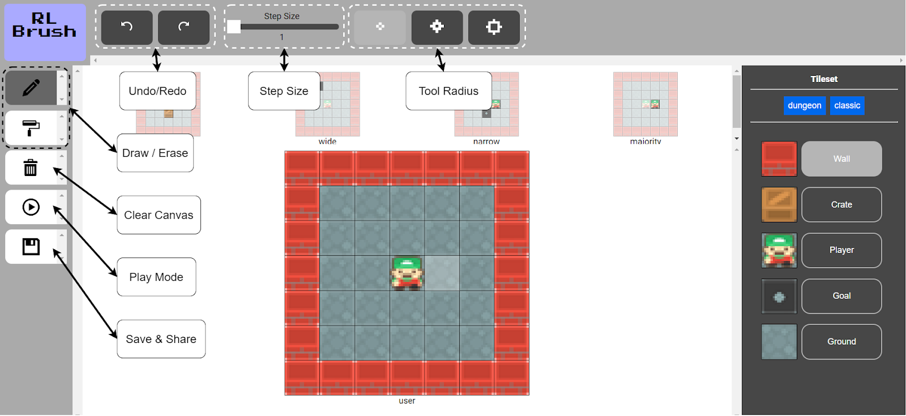
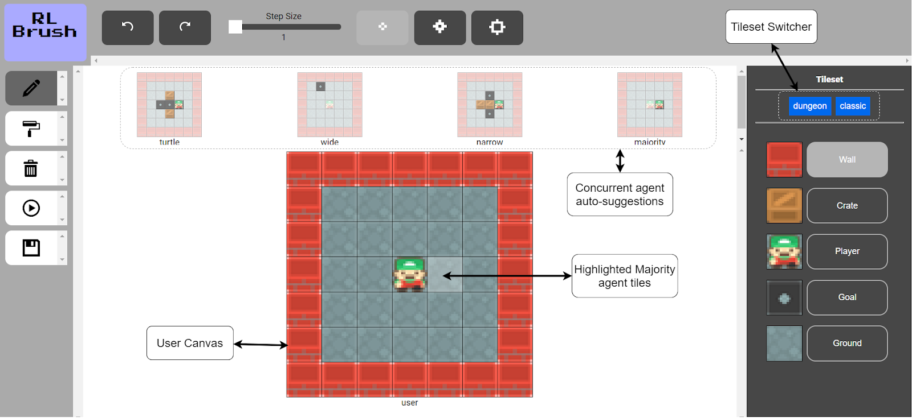
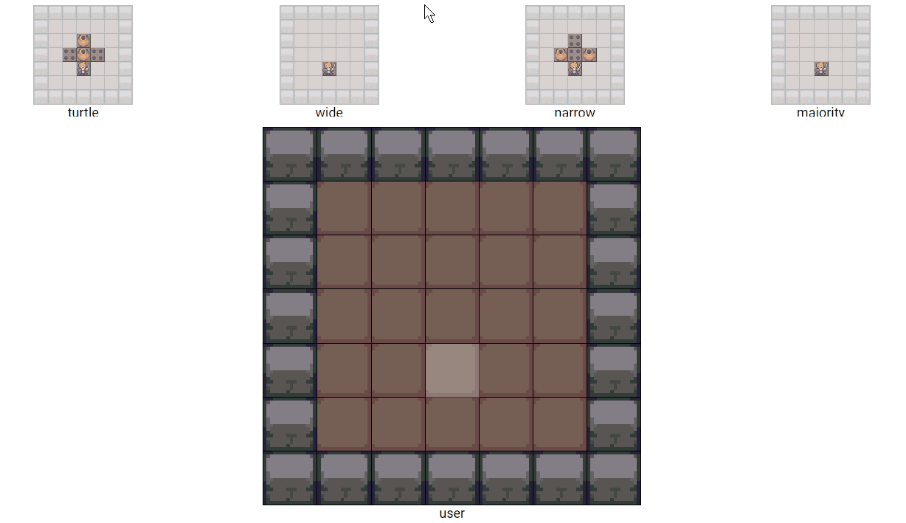
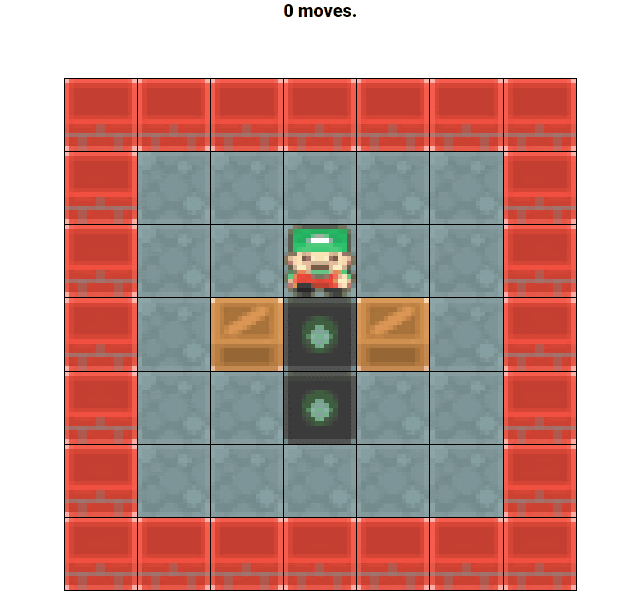
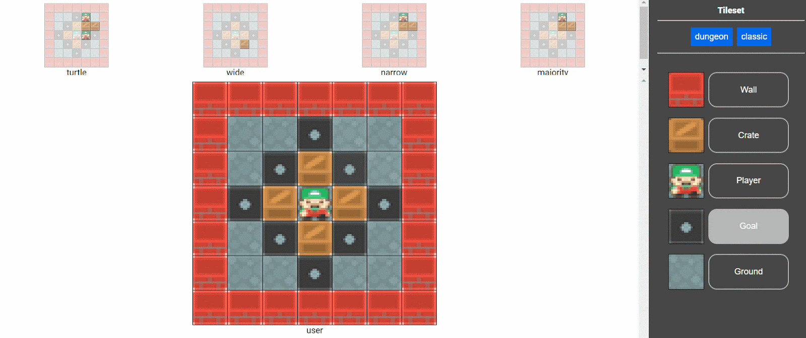
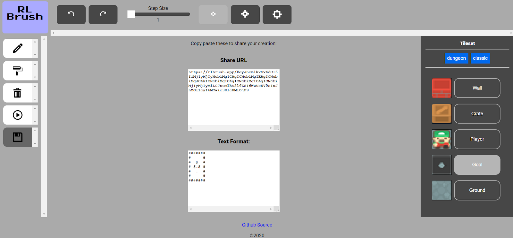

# Instructions

**Table of Contents:**

-   [Actions](#actions)
-   [UI Overview](#ui-overview)
-   [Suggestions](#suggestions)
-   [Play Mode](#play-mode)
-   [Tileset Switching](#tileset-switching)
-   [Sharing Your Level](#sharing-your-level)
-   [Feedback](#feedback)

## Actions

| Action Name                           | Description                                                                                                                 |
| ------------------------------------- | --------------------------------------------------------------------------------------------------------------------------- |
| [Draw/Erase](#ui-overview)            | Freely add/remove tiles. Use the Tileset window to switch between tiles. Click anywhere on the user canvas to place a tile. |
| [Clear Canvas](#ui-overview)          | Reset the entire canvas to blank space tiles.                                                                               |
| [Play Mode](#play-mode)               | Test the level and play Sokoban.                                                                                            |
| [Save And Share](#sharing-your-level) | Generate sharable URL or txt of level.                                                                                      |
| [Step Size](#ui-overview)             | Control the lookahead of the TensorFlow model. More steps improves suggestion quality at the expense of slower suggestions. |
| [Tool Radius](#ui-overview)           | Control how many tiles are observable to the TensorFlow model based on a von Neuman neighborhood around the selected tile.  |
| [Tileset Switch](#tileset-switching)  | Switch between Dungeon or Classic tileset themes.                                                                           |
| [Agent Suggestions](#suggestions)     | These suggested board states are generated by the TensorFlow model.                                                         |

## UI Overview

Here is an outline of all the buttons available in the UI.

## Suggestions

The TensorFlow model outputs suggestions in the form of board states. By clicking on each one you can apply its changes to the current User Canvas. There are 4 AI agent types:

-   turtle
-   wide
-   narrow
-   majority

Each one has a different strategy for generating the suggestions.

## Play Mode

Play mode allows you to play your test level using the WASD keys.

## Tileset Switching

Switch between Dungeon or Classic tileset themes. These change the look of your board.

## Sharing Your Level

You can share the levels you create either through a URL or by copying and pasting the txt-format level. This allows you to use the level in other Sokoban environments.

## Feedback

To send feedback, please use this google form:

https://forms.gle/tiBc86urqQamhsAEA

Or click on the bullhorn icon:

