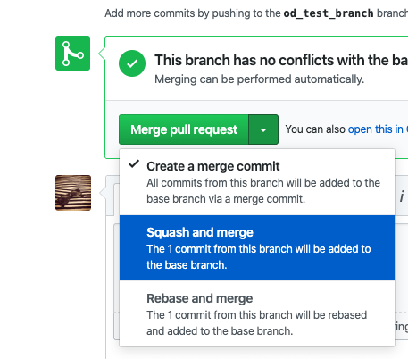

# RL Brush


[https://rlbrush.app/](https://rlbrush.app/)

## Usage

For full instructions on how to use RLBrush, checkout the [Instructions document](/instructions.md)

## Setup

```bash
yarn install
yarn start
```

Once this is running, the dev server can be accessed via browser at:

```
http://localhost:3000/
```

This project was bootstrapped using `create-react-app`. You can see the other readme for it at [cra-README.md](/cra-README.md) with more instructions.

## Python Setup

Python files in this repo are all namespaced under the `py/` subdirectory.

1. Clone PCGRL Gym repo to a directory _outside of this repo_:

```bash
git clone https://github.com/amidos2006/gym-pcgrl
```

2. `pip` install the gym-pcgrl package:

```
cd /path/to/gym-pcgrl
pip install -e .
```

3. Switch back to `py/` in this repo.

4. Test your environment by running `test-env.py`.

## Contributing

1. Make a branch from `master` and add your changes:

```bash
git checkout master # switch to master branch
git pull origin master # sync up with remote
git checkout -b your_branch_name # make your new branch

# make changes
git add -A . # add your changes
git commit -m "description of your changes"
git push origin your_branch_name
```

2. Using this branch, open a pull request on Github ([Instructions here](https://opensource.com/article/19/7/create-pull-request-github))

3. Make sure pull request status checks pass and the group gets a heads up.

4. Merge your pull request. Ideally, try to use the `Squash and Merge` feature to consolidate all your commits into 1 before merging.



## Development Guide

### Layout

The layout of the UI can be generally updated using the `src/Layout/styles.css` file. This can be used to adjust the spacing between each section.

By uncommenting all the background colors, spacing issues can be more easily debugged:


### Components

Each component is located in the `src/` directory and given its own folder. Each folder contains an `index.tsx` and a `styles.css` file to describe the TypeScript and CSS respectively.

### Icons

All icon files are available in the `src/Icons` directory but they are not all componentized. They are from a library available here:

[https://icomoon.io/#icons](https://icomoon.io/#icons)

To componentize an icon simply add a component for it in `src/Icons/index.tsx`. Example:

```typescript
// Define a unique constructor name starting with Icon
import { ReactComponent as IconFoo } from "./000-foo.svg";

// ...
function Icon(props: IconProps) {
    const iconProps = {
        // ...
    };
    switch (props.iconName) {
        case "pencil":
            return <IconPencil {...iconProps} />;
        case "foo-unique-name": // give the icon a unique name
            return <IconFoo {...iconProps} />; // return its component
        default:
            // This is basically an unsupported icon
            return <div>{"UNSUPPORTED ICON: ${iconName}"}</div>;
    }
}
```

### Services

Services are ways to encapsulate our utility classes in a convenient place. Example:

```typescript
export class MyUtilityService {
    public someMethodOfTheService() {
        // ...
    }

    public static someStaticMethodOfTheService() {
        // ...
    }
}
```

#### AppStateService

The `src/services/AppState` service scaffolds and manages the setup of the global application state.

#### Numeric

The `src/services/Numeric` service manages math operations, data structure creation etc.

#### TensorFlowService

TensorFlow operations live inside `src/services/TensorFlow` as stateless functions in the `TensorFlowService` class. This allows for separation of concerns and makes them easily usable anywhere else in the code without much boilerplate.
